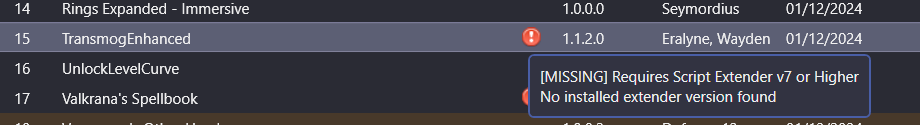
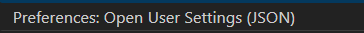

# Windows Rice - a heurisitc take on the desktop

After spending a long time trying to set up different linux distros, window managers etc etc, I have ran into enough issues that I feel like using linux is lovely and all, but I don't have infinite time to fix problems

- Wifi not working
- Where do I set my themes again
- icons not working
- more networking problems
- can't run games that use EasyAntiCheat

I wanted a computer that just works

That being said, I don't think I could ever go back to the default windows experience, tiling WMs are just too beautiful and using the commandline for certain tasks is just too convenient and cool

Within this repo, I hope to document my journey of creating a linux tiling-wm-like experience whilst combining it with the ease of use and out-out-the-boxness of windows

I also want this to be a design blueprint for how somene's entire digital needs can be met, hence why I'll be listing what services I use for pretty much everything

## Baldur's gate 3 modding
Mod manager:
https://github.com/LaughingLeader/BG3ModManager

Open, run, set path to bg3


Get script extender:
https://www.nexusmods.com/baldursgate3/mods/2172?tab=description

Get Mod fixer:
https://www.nexusmods.com/baldursgate3/mods/141

Improved UI (apparentally this is a pre-requisite for a lot of mods):
https://www.nexusmods.com/baldursgate3/mods/366

No-ilithid veins (putting the link here cause I don't mind it o:
https://www.nexusmods.com/baldursgate3/mods/773

Encountered a problem - the mod manager thinks I don't have the script extender installed. I even tried installing it through the installer and it still hasn't fixed it...



#### SOLUTION: You need to run the game at least once for the script extender installation to be completed


## Current TODOs
- [ ] rice out zebar
- [ ] rice out flow launcher
- [ ] system color generation from wallpaper

## Things to do
- [x] Update system
- [x] Remove default bloatware
- [x] Browser
- [x] Graphics Drivers
- [x] Git
- [x] ssh-keygen
- [x] Vim
- [x] GlazeWM
- [x] Flow Launcher

List of software we want:
- [x] Git
- [x] Brave
- [x] Steam
- [x] GOG
- [x] Battlenet
- [x] Discord
- [x] AMD Adrenaline
- [x] Razer Synapse
- [x] VSCode
- [x] GIMP
- [ ] Path of Building
- [ ] Awakened POE Trade
- [x] Vim
- [x] Python
- [x] OnlyOffice
- [x] KeePassXC

Current Solution Choices:
- Email = Proton 
- Browser = Brave & Edge for DRM stuff
- Search Engine = Google (Let's not delude ourselves, the only engine that gives good search results)
- IDE = VSCode (with VIM plugin)
- VPN = protonVPN
- Calendar = Proton 
- Cloud Storage = Proton

## Windows 11 Setup Gen 1 Notes
### Installing windows 11 with a local account
SHIFT + F10 
Then typing "oobe\bypassnro" worked for me (after unplugging ethernet etc)
NOTE: Make sure all security questions are lowercase to avoid confusion when you have to recall them
Also, see below if in doubt?
https://answers.microsoft.com/en-us/insider/forum/all/set-up-windows-11-without-internet-oobebypassnro/4fc44554-b416-4ecb-8961-6f79fd55ae0f

## MAKE SURE YOU REMOVE THE ACTIVITY TRACKER IN PRIVACY SETTINGS

### Removing bloatware
I had to uninstall the following:
- Family
- Feedback Hub
- Mail and Calendar
- Maps
- Microsoft Clipchamp
- Microsoft Bing Search
- Microsoft OneDrive
- Microsoft Teams
- Microsoft Todo
- OneNote
- Outlook
- People
- Quick Assist
- Skype???? 
- Solitaire ???????????????
- Sticky notes
- Xbox
- Xbox Live...
- Remote Desktop Connection
- Microsoft News
- Microsoft 365
- LinkedIn

### Other notes
- Press the update button multiple times until it stops spitting updates, I had to press it three times before windows decided that it is now fully up to date
- Restart after each step

 
### Visual changes
- Dark theme
- Taskbar settings, disable widgets and task view. Also set search icon only

### Brave setup
- Set to open a new tab on startup and set new tab to blank page
- Search engine set to google
- Hide wallet, sidebar, leo AI and VPN sidebar button
- Rightclick address bar: always show full address
- Under appearance set: show bookmarks bar always

### Vim installation
Just use the installer from the vim website

### GlazeWM and the bar
All installed using winget as per instructions on the GlazeWM github page

Very good default keybinds so no complaints

Will need to edit the config a bit so that that we focus on the window with cursour on it and also so cursour snaps to the focused window on focus change.

Made necessary edits in the config, will need to test how it works with games to decide whether to rebind alt-tab to swap between workspaces


### Configuring zebar

to be configured...

I need vscode to do this tbh

install nerdfonts too btw

### App Launcher

Installed flow launcher and it is amazing

Make sure the binds in GlazeWM don't collide with Flow or it wont work (they do by default)


### VSCode Customisation

Vim Plugin:
https://marketplace.visualstudio.com/items?itemName=vscodevim.vim

The main change I care about is that I exit input mode with "jk" by putting "inoremap jk <ESC>" into my vimrc file, if you want this as well do the below:

Open your settings JSON file:
1. CTRL + SHIFT + P
2. User Settings JSON



This should open your user settings file, put the code below into the curly brackets:

```JSON
"vim.insertModeKeyBindings": [
    {
        "before": ["j", "k"],
        "after": ["<ESC>"]
    }
]
"vim.handleKeys": {
    "<C-s>": false,
    "<C-z>": false,
    "<C-c>": false,
    "<C-v>": false
}
```

LIBRARY:

### Could be useful for the vim installation
https://shayallenhill.com/vim-in-windows#install-vim
### Local account
https://answers.microsoft.com/en-us/insider/forum/all/set-up-windows-11-without-internet-oobebypassnro/4fc44554-b416-4ecb-8961-6f79fd55ae0f

