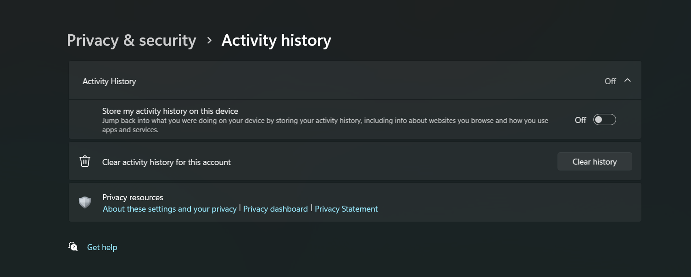
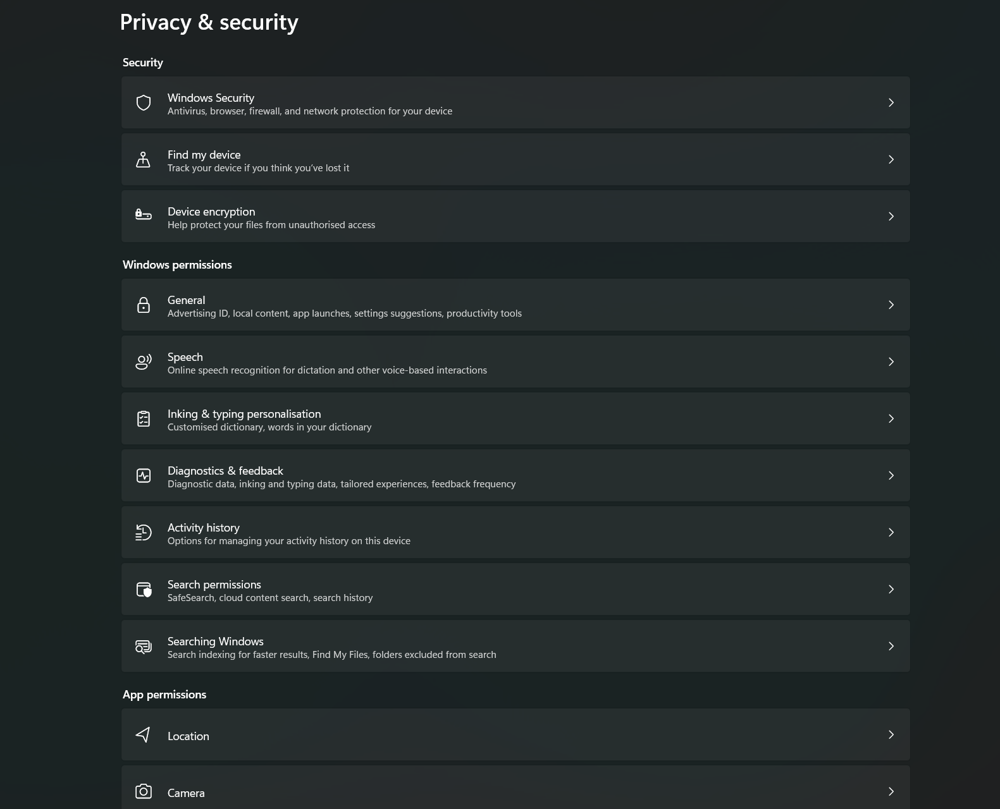

# Windows Rice - a heurisitc take on the desktop

TLDR; Linux takes too much effort and has limited compatibility in places - let's make Windows a little more homey instead

DISCLAIMER: I make no claims about the privacy, security or stability of a system set up according to my instructions, I provide these to you with best intentions and to help people out however I can't make any guarantees and follow these instructions at your own risk. That being said, I set up all my computers using this and never had any problems

# Let's set up windows 11
1. [Windows 11 Install](#1-windows-11-install)
2. [Privacy Changes](##2-privacy)
3. [Remove bloat](##3-removing-bloatware)
4. [Update system](##4-update-system)
5. [Visual changes](##5-visual-changes)
6. [Browser](##6-browser)
7. [Graphics drivers](##7-graphic-drivers)
8. [Git](##8-git)
9. [SSH-Keygen](##9-ssh-keys)
10. [VIM](##10-vim)
11. [Flow Launcher](##11-flow-launcher)
12. [ImageMagick](##12-ricing-prerequisites)
13. [GlazeWM](##13-glazewm)
14. [Colour Sync](##14-colour-sync)
15. [Installing software](##15-software-install)

# 1: Windows 11 Install
SHIFT + F10 
Then typing "oobe\bypassnro" worked for me (after unplugging ethernet etc)
NOTE: My recommendation is that all security questions are lowercase to avoid confusion when you have to recall them (not sure if they are case sensitive but why take the risk)
Also, see below if in doubt:
https://answers.microsoft.com/en-us/insider/forum/all/set-up-windows-11-without-internet-oobebypassnro/4fc44554-b416-4ecb-8961-6f79fd55ae0f

## 2: Privacy
! MAKE SURE YOU REMOVE THE ACTIVITY TRACKER IN PRIVACY SETTINGS !


Go through all the sections and review them in the settings as per your requirements and preferences


## 3: Removing bloatware
I had to uninstall the following:
- Family
- Feedback Hub
- Mail and Calendar
- Maps
- Microsoft Clipchamp
- Microsoft Bing Search
- Microsoft OneDrive
- Microsoft Teams
- Microsoft Todo
- OneNote
- Outlook
- People
- Quick Assist
- Skype???? 
- Solitaire ???????????????
- Sticky notes
- Xbox
- Xbox Live...
- Remote Desktop Connection
- Microsoft News
- Microsoft 365
- LinkedIn

## 4: Update system
- Press the update button multiple times until it stops spitting updates, I had to press it three times before windows decided that it is now fully up to date
- Restart after each step

## 5: Visual changes
- Dark theme
- Taskbar settings, disable widgets and task view. Also set search icon only. Hide Taskbar 

## 6: Browser
Install Firefox and Brave browser
At the time of writing this, links below are correct:
- Brave: https://brave.com/
- Firefox: https://www.mozilla.org/

#### Within brave settings
- Set to open a new tab on startup and set new tab to blank page
- Search engine set to google
- Hide wallet, sidebar, leo AI and VPN sidebar button
- Rightclick address bar: always show full address
- Under appearance set: show bookmarks bar always


## 7: Graphics drivers
Simply download these from AMD / Nvidia's website

## 8: Get git
Link at the time of writing: https://git-scm.com/

Simply download and follow the installation steps


## 9: SSH Keys
use ssh-keygen to generate ssh keys to be used with your github account

## 10: VIM - Our lord and saviour

Install vim from the website (link correct at time of writing)
https://www.vim.org/


put this into your vimrc file:

```
vim9script

# defaults
source $VIMRUNTIME/defaults.vim

if has("windows")
	set shell=pwsh
endif

inoremap jk <ESC>
set backupdir=~/.vimbackups//
set backup
```

We will set up our vscode config later

## 11: Flow Launcher
Install the system version, do not go with the portable one as I am not sure if my theming will work with it

```
winget install "Flow Launcher"
```
## 12: Ricing Prerequisites
We need imagemagick, pywal and will need to install UbuntuMono Nerd Font
https://imagemagick.org/script/download.php

Pywal:
```
pip install pywal
```

UbuntuMono Nerd Font:
https://www.nerdfonts.com/font-downloads

(as per usual, links correct at time of writing)

## 13: GlazeWM
```
winget install GlazeWM
```
## 14: Colour Sync
This is where it gets a little bit complicated, since the script I wrote to do all this is not finished yet, so you are going to have to just clone this repo (using git we installed earlier) and run the main.py file using python

Pass it one argument (the image to use for generating colours)

If you want to just scrape the colours from wallpaper but not use it for your system then pass the appropriate flag. Pass --help or -h to see flags
## 15: Software Install

This section is yet to be completed,  I find it difficult to decide whether to split the stuff we need into categories / do I include stuff that was already installed in previous steps?

Optional:
List of software we want:
- [x] Git
- [x] Brave
- [x] Steam
- [x] GOG
- [x] Battlenet
- [x] Discord
- [x] AMD Adrenaline
- [x] Razer Synapse
- [x] VSCode
- [x] GIMP
- [x] OBS
- [x] Wiztree
- [x] Vim
- [x] Python
- [x] OnlyOffice
- [x] KeePassXC


# Coloursync notes


Something I learned, is to make sure that pip and pip3 link to the same python version (which they do in a lot of cases) just run them with the `--version` flag

Disable windows casting shadows so they don't go over your bar:

Advanced System Settings > Advanced > Performance > Settings... > Untick "Show shadows under windows"

We need imagemagick
https://imagemagick.org/script/download.php


# Solutions

Current Solution Choices:
- Email = Proton 
- Browser = Brave & Firefox for DRM stuff
- Search Engine = Google (Let's not delude ourselves, the only engine that gives good search results)
- IDE = VSCode (with VIM plugin)
- VPN = protonVPN
- Calendar = Proton 
- Cloud Storage = Proton

# VSCode Customisation

Vim Plugin:
https://marketplace.visualstudio.com/items?itemName=vscodevim.vim

The main change I care about is that I exit input mode with "jk" by putting "inoremap jk <ESC>" into my vimrc file, if you want this as well do the below:

Open your settings JSON file:
1. CTRL + SHIFT + P
2. User Settings JSON


This should open your user settings file, put the code below into the curly brackets:

```JSON
"vim.insertModeKeyBindings": [
    {
        "before": ["j", "k"],
        "after": ["<ESC>"]
    }
]
"vim.handleKeys": {
    "<C-s>": false,
    "<C-z>": false,
    "<C-c>": false,
    "<C-v>": false
}
```

# Random things

## Baldur's gate 3 modding
Mod manager:
https://github.com/LaughingLeader/BG3ModManager

Open, run, set path to bg3


Get script extender:
https://www.nexusmods.com/baldursgate3/mods/2172?tab=description

Get Mod fixer:
https://www.nexusmods.com/baldursgate3/mods/141

Improved UI (apparentally this is a pre-requisite for a lot of mods):
https://www.nexusmods.com/baldursgate3/mods/366

No-ilithid veins (putting the link here cause I don't mind it o:
https://www.nexusmods.com/baldursgate3/mods/773

Encountered a problem - the mod manager thinks I don't have the script extender installed. I even tried installing it through the installer and it still hasn't fixed it...


#### SOLUTION: You need to run the game at least once for the script extender installation to be completed

NOTE: Played a bit with it, highly recommend the mod that unlocks the 5e spells btw! :)
https://www.nexusmods.com/baldursgate3/mods/125

## Current TODOs
- [x] rice out zebar
- [x] rice out flow launcher
- [ ] Nicer workspace removal animation (more smooth)
- [ ] Algorithmically optimised palette (for contrast)
- [ ] review glazeWM keybinds
- [x] system color generation from wallpaper


# LIBRARY:

### Could be useful for the vim installation
https://shayallenhill.com/vim-in-windows#install-vim
### Local account
https://answers.microsoft.com/en-us/insider/forum/all/set-up-windows-11-without-internet-oobebypassnro/4fc44554-b416-4ecb-8961-6f79fd55ae0f

